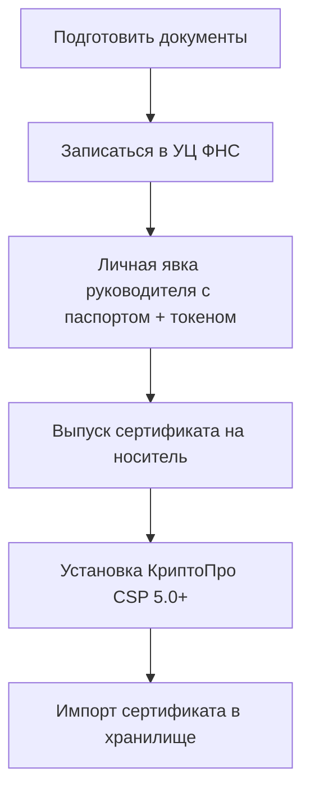

# service-ukep — Выпуск и подключение обезличенной УКЭП (служебной учётной записи) для True API

**Статус:** Активен

## Предпосылки

В текущей архитектуре приложения аутентификация в True API выполняется через УКЭП **физического лица** (сотрудника) с помощью КриптоПро Browser Plugin на стороне клиента. Это означает, что:
- Для каждого сеанса нужен человек с токеном
- Нельзя организовать полностью автоматический обмен (сервер-сервер)
- При увольнении сотрудника доступ теряется

Для автоматической интеграции требуется **обезличенная УКЭП (ОУКЭП)** — сертификат на организацию, без привязки к физлицу.

---

## 1. Юридические основания

| Нормативный акт | Описание |
|-----------------|----------|
| **63-ФЗ ст. 5 п. 2** | Допускается УКЭП, в сертификате которой не указано физлицо (обезличенная), для автоматического создания/проверки ЭП |
| **Приказ ФНС от 08.06.2021 № ЕД-7-24/538@** | Порядок выдачи обезличенных сертификатов УЦ ФНС |
| **443-ФЗ от 01.09.2024** | КЭП оформляется только на директора (без доверенности); для автоматизации — только ОУКЭП |

ОУКЭП применяется для электронных документов, **автоматически формируемых и представляемых** в ГИС МТ, за исключением:
- Заявления о регистрации участника
- Заявки на тестирование
- Заявки на доступ к устройству регистрации эмиссии

---

## 2. Сравнение вариантов

| Характеристика | ОУКЭП (обезличенная) | КЭП физлица + МЧД | API-ключ (x-api-key) |
|----------------|----------------------|--------------------|---------------------|
| **Кому выдаётся** | Организации (без физлица) | Физлицу | Организации (в ЛК) |
| **Без человека** | ✅ Да — полный автомат | ❌ Нет — нужен человек с токеном | ✅ Да |
| **Срок** | 15 месяцев | 12-15 месяцев | до 01.07.2026 (продление?) |
| **Доступ к True API** | ✅ Полный | ✅ Полный | ❌ Только касса (розн. режим) |
| **Стоимость** | 0 ₽ (УЦ ФНС) / 3–10 тыс. ₽ (коммерч.) | ~3 000 ₽/год | 0 ₽ |
| **Риски** | Низкие | Увольнение сотрудника | Ограниченный функционал |

**Вывод:** для серверной интеграции с True API требуется именно ОУКЭП.

---

## 3. Порядок выпуска ОУКЭП через УЦ ФНС (бесплатно)

### 3.1. Подготовка документов

| № | Документ | Примечание |
|---|----------|------------|
| 1 | **Письмо-заявление** на официальном бланке организации | С обоснованием: «для автоматического обмена с ГИС МТ через True API» |
| 2 | **Копия распорядительного документа** о создании информационной системы | Приказ о вводе в эксплуатацию информационной системы, осуществляющей автоматический обмен |
| 3 | **Паспорт руководителя** (оригинал) | Личная явка в УЦ ФНС |
| 4 | **СНИЛС руководителя** | |
| 5 | **ИНН организации + ИНН руководителя** | |
| 6 | **Выписка из ЕГРЮЛ** | Свежая (не старше 1 мес.) |
| 7 | **Решение о назначении руководителя** | Протокол / приказ |
| 8 | **USB-токен** | Рутокен ЭЦП 3.0 или JaCarta-2 ГОСТ (см. п. 3.2) |

**Образцы документов:**
- Письмо-заявление: https://github.com/romangorbenko/OUKEP/blob/main/letter.docx
- Приказ о создании ИС: https://github.com/romangorbenko/OUKEP/blob/main/order.docx
- Приказ о назначении ответственного: https://github.com/romangorbenko/OUKEP/blob/main/ResponsibleAppointment.docx

### 3.2. Требования к носителю (2026 год)

С 1 апреля 2026 все КЭП — только по новым ГОСТ 34.12-2018 / 34.13-2018.

| Носитель | Статус |
|----------|--------|
| **Рутокен ЭЦП 3.0** | ✅ Работает |
| **JaCarta-2 ГОСТ** | ✅ Работает |
| **JaCarta-3** | ✅ Работает |
| Рутокен ЭЦП 2.0 | ❌ Устарел (не принимается) |
| Рутокен Lite | ❌ Не сертифицирован |
| eToken (старые) | ❌ Не сертифицированы |

### 3.3. Процесс получения



1. Записаться в ближайшую ИФНС, оказывающую услуги УЦ (перечень на nalog.gov.ru)
2. Явиться лично с комплектом документов и USB-токеном
3. Сотрудник УЦ проверяет документы, идентифицирует личность, выпускает сертификат
4. Получить носитель с записанным сертификатом
5. **Срок:** от 1 часа до 3 рабочих дней
6. **Срок действия:** 15 месяцев

### 3.4. Альтернатива — коммерческий УЦ

| УЦ | Ориентировочная стоимость | Примечание |
|----|---------------------------|------------|
| Контур (ca.kontur.ru) | ~5 000–8 000 ₽/год | Удалённо, курьер |
| Такском (taxcom.ru) | ~4 000–7 000 ₽/год | Удалённо |
| СБИС (sbis.ru) | ~5 000–10 000 ₽/год | Удалённо |
| Астрал (astral.ru) | ~3 000–6 000 ₽/год | Удалённо |

**Плюсы:** не нужна личная явка в ФНС, быстрее, сопровождение.
**Минусы:** платно.

---

## 4. Техническая подготовка к автоматической подписи (сервер)

### 4.1. Схема работы

```
Сервер (Linux)
├── КриптоПро CSP 5.0 R2+  ← подпись УКЭП
├── Носитель с ОУКЭП
│   ├── Физический USB (Рутокен) → через USB-over-IP (NIO-EUSB / Digi AnywhereUSB)
│   └── Или виртуальный (копия ключа, если разрешено политикой)
├── Наше приложение (backend)
│   ├── got → True API (auth/key, simpleSignIn)
│   └── crypto-pro (или КриптоПро CLI) → подпись data
└── Хранилище сертификатов (/var/opt/cprocsp/...)
```

### 4.2. Требования к серверу

| Компонент | Версия | Назначение |
|-----------|--------|------------|
| **ОС** | Linux (x86_64) | Рекомендуется Ubuntu 22.04+/Debian 12+/Astra Linux |
| **КриптоПро CSP** | 5.0.12000+ (5.0 R2) | Криптопровайдер |
| **КриптоПро CLI (cryptcp)** | из состава CSP | Генерация запросов, подпись |
| **lsb-cprocsp-devel** | из состава CSP | Разработка |
| **USB-токен** | Рутокен ЭЦП 3.0 / JaCarta-2 ГОСТ | Носитель ключа |
| **pcscd** | любая | Демон для работы с USB-токенами |
| **Node.js** | 20+ | Наше приложение |

### 4.3. Установка КриптоПро CSP на сервер

```bash
# 1. Скачать дистрибутив с cryptopro.ru (требуется авторизация)
#    linux-amd64_deb.tgz

# 2. Установить
tar -xzf linux-amd64_deb.tgz
cd linux-amd64_deb
./install.sh

# 3. Проверить установку
/opt/cprocsp/sbin/cryptopro -v

# 4. Установить лицензию
/opt/cprocsp/bin/cryptopro -setkey <license-key>

# 5. Подключить токен (через USB или USB-over-IP)
#    Убедиться, что pcscd запущен
systemctl start pcscd

# 6. Проверить видимость токена
/opt/cprocsp/bin/cryptopro -list
```

### 4.4. Генерация запроса на сертификат (PKCS#10)

Если ОУКЭП выпускается через УЦ ФНС **впервые** (без готового носителя), нужно сгенерировать запрос на сервере и передать его в УЦ.

**Сгенерировать контейнер и запрос:**

```bash
/opt/cprocsp/bin/cryptcp -createrqst /tmp/request.req \
  -rdn "CN=\"ООО \"\"РОМАШКА\"\"\", E=admin@company.ru, C=RU, S=\"77 г. Москва\", L=\"Москва\", STREET=\"ул. Ленина д.1\", O=\"ООО \"\"РОМАШКА\"\"\", 1.2.643.100.4=7700123456, 1.2.643.100.1=1234567890123" \
  -pin "" \
  -provtype 80 \
  -provname "Crypto-Pro GOST R 34.10-2012 Cryptographic Service Provider" \
  -certusage 1.3.6.1.5.5.7.3.2 \
  -ext RemoteCertificate.ext
```

Где:
- `1.2.643.100.4` — ИНН организации (10 цифр)
- `1.2.643.100.1` — ОГРН (13 цифр или 15 для ИП)
- `RemoteCertificate.ext` — файл с OID для удалённого выпуска (без личной явки) — [скачать шаблон](https://raw.githubusercontent.com/romangorbenko/OUKEP/main/RemoteCertificate.ext)

Файл `request.req` передаётся в УЦ ФНС (на USB-флешке, вместе с пакетом документов из п. 3.1).

### 4.5. Установка полученного сертификата на сервер

```bash
# Установить сертификат в контейнер
/opt/cprocsp/bin/cryptcp -inst \
  -cont "\\.\A-<идентификатор контейнера>" \
  -cert /tmp/certificate.cer

# Проверить
/opt/cprocsp/bin/cryptopro -list
```

### 4.6. Подпись данных (автоматическая)

**Вариант A — через CLI (cryptcp):**

```bash
echo -n "$DATA" | base64 -d > /tmp/data_to_sign.bin
/opt/cprocsp/bin/cryptcp -sign \
  -detached \
  -thumbprint <THUMBPRINT> \
  /tmp/data_to_sign.bin /tmp/signature.sig
cat /tmp/signature.sig | base64 -w0
```

**Вариант B — через Node.js binding (`@vgoma/crypto-pro`):**

Пакет `@vgoma/crypto-pro` умеет работать с КриптоПро CSP на сервере (не только в браузере). Требует установленного CSP и библиотеки `lsb-cprocsp-devel`.

```typescript
import { createAttachedSignature } from '@vgoma/crypto-pro'

const signature = await createAttachedSignature(thumbprint, base64data)
```

**Вариант C — через REST-сервис КриптоПро (CryptoPro DSS):**

КриптоПро предоставляет DSS (Digital Signature Service) — REST API для подписи. Устанавливается как отдельный сервис.

### 4.7. Дооснащение backend-контейнера (`backend/Dockerfile`)

Текущий Dockerfile использует `node:20-alpine`. Для работы с КриптоПро потребуется:

```dockerfile
# Вариант: переход на образ с КриптоПро CSP
FROM node:20-bookworm AS builder
WORKDIR /app
COPY package.json package-lock.json ./
RUN npm ci
COPY src/ ./src/
RUN npm run build

FROM node:20-bookworm AS runner
WORKDIR /app

# Установка КриптоПро CSP
COPY cprocsp/*.deb /tmp/
RUN dpkg -i /tmp/*.deb || true
RUN apt-get install -f -y && \
    /opt/cprocsp/sbin/cryptopro -setkey <license>

# Установка НЦА (сертификаты УЦ)
RUN /opt/cprocsp/sbin/cpverify -install ...

# USB-over-IP клиент (если токен не локальный)
COPY nio-eusb-client /usr/local/bin/

COPY --from=builder /app/dist ./dist
COPY --from=builder /app/node_modules ./node_modules

EXPOSE 3001
CMD ["node", "dist/index.js"]
```

**Или проще:** использовать готовый образ от КриптоПро или развернуть сервис подписи на отдельной ВМ, а наш backend будет вызывать его по REST.

---

## 5. Регистрация ОУКЭП в личном кабинете Честного знака

### 5.1. Для True API (ГИС МТ)

После получения сертификата его нужно зарегистрировать в ГИС МТ:

1. Войти в ЛК Честного знака: https://markirovka.crpt.ru (с УКЭП руководителя)
2. Перейти: **Профиль → Администрирование → Учётные системы**
3. Нажать **«Добавить учётную систему»**
4. Указать наименование (например, «Сервер интеграции API»)
5. В карточке учётной системы нажать **«Добавить сертификат»**
6. Загрузить **открытую часть сертификата** (файл .cer)

**Важно:** для каждого контура (sandbox / prod) регистрация выполняется отдельно.

### 5.2. Внутренний распорядительный акт (обязательно)

Требование 63-ФЗ: издать приказ о назначении **ответственного лица** за автоматическое создание/проверку ЭП в информационной системе.

Документ должен содержать:
- ФИО сотрудника, ответственного за автоматическую подпись
- Регламент работы информационной системы
- Порядок действий при компрометации ключа

Без этого акта использование ОУКЭП юридически недействительно.

---

## 6. Техническая интеграция — изменения в приложении

### 6.1. Изменение архитектуры

Сейчас подпись выполняется **на клиенте** (в браузере через CadesPlugin). После внедрения ОУКЭП:

```
Схема А: только серверная подпись (рекомендуется)
─────────────────────────────────────
Frontend (браузер)                Backend (наш сервер)               True API
      │                                │                                │
      │   GET /auth/key                 │                                │
      │───────────────────────────────>│                                │
      │                                │   GET /auth/key                │
      │                                │──────────────────────────────>│
      │                                │<────────────────────────────── │
      │   { uuid, data }               │                                │
      │<───────────────────────────────│                                │
      │                                │                                │
      │   POST /auth/simpleSignIn      │   (подпись на сервере)         │
      │   { uuid }                     │   через КриптоПро CSP          │
      │───────────────────────────────>│                                │
      │                                │   POST /auth/simpleSignIn      │
      │                                │   { uuid, data: <sign> }      │
      │                                │──────────────────────────────>│
      │                                │<────────────────────────────── │
      │   { token }                    │                                │
      │<───────────────────────────────│                                │
```

**Изменения:**
- Frontend отправляет только `{ uuid }` (без data)
- Backend сам подписывает data через установленный КриптоПро CSP
- Browser Plugin на стороне клиента больше **не нужен** для авторизации
- Весь процесс аутентификации — на backend

### 6.2. Модификация backend-сервисов

**`auth-service.ts`:**

```typescript
import { execSync } from 'child_process'

function signData(dataBase64: string): string {
  const thumbprint = process.env.CERT_THUMBPRINT
  // Вариант 1: через CLI cryptcp
  const result = execSync(
    `/opt/cprocsp/bin/cryptcp -sign -detached -thumbprint ${thumbprint} /dev/stdin /dev/stdout`,
    { input: Buffer.from(dataBase64, 'base64') }
  )
  return result.toString('base64')

  // Вариант 2: через @vgoma/crypto-pro (асинхронно)
  // return createAttachedSignature(thumbprint, dataBase64)
}

export async function getAuthKey(env: TrueApiEnv): Promise<AuthKeyResponse> {
  // ... без изменений
}

export async function serverSignIn(env: TrueApiEnv): Promise<AuthSignInResponse> {
  const { uuid, data } = await getAuthKey(env)
  const signature = signData(data)
  return signIn(env, { uuid, data: signature })
}
```

**Новый endpoint:**

```typescript
// POST /auth/server-login — полная авторизация на backend
app.post('/auth/server-login', async (request, reply) => {
  const env = parseEnv(request.query)
  try {
    const result = await serverSignIn(env)
    return result
  } catch (err) {
    // обработка ошибок
  }
})
```

### 6.3. Необходимые файлы

| Файл | Назначение |
|------|------------|
| `backend/certs/certificate.cer` | Открытая часть сертификата ОУКЭП |
| `backend/Dockerfile` | Установка КриптоПро CSP + импорт сертификата |
| `backend/src/services/crypto-service.ts` | Сервис подписи через КриптоПро |
| `.env` / secrets | `CERT_THUMBPRINT`, лицензия КриптоПро |

### 6.4. Переменные окружения (добавить в .env)

```env
# Режим аутентификации: client (через браузер) или server (через ОУКЭП)
AUTH_MODE=server

# Отпечаток сертификата ОУКЭП
CERT_THUMBPRINT=<sha1-thumbprint>

# Только для AUTH_MODE=server:
# Путь к файлу открытой части сертификата (для валидации)
CERT_FILE=/app/certs/certificate.cer
```

---

## 7. Пошаговый план действий

### Этап 1. Подготовка документов

- [ ] 1.1. Подготовить письмо-заявление на бланке организации
- [ ] 1.2. Подготовить приказ о создании информационной системы
- [ ] 1.3. Подготовить приказ о назначении ответственного за автоматическую подпись
- [ ] 1.4. Собрать остальные документы (паспорт, СНИЛС, ИНН, выписка ЕГРЮЛ)
- [ ] 1.5. Приобрести Рутокен ЭЦП 3.0 или JaCarta-2 ГОСТ

### Этап 2. Получение ОУКЭП

- [ ] 2.1. Записаться в УЦ ФНС (или выбрать коммерческий УЦ)
- [ ] 2.2. Явиться лично с документами и носителем
- [ ] 2.3. Получить сертификат на носитель
- [ ] 2.4. Скопировать открытую часть сертификата (.cer)

### Этап 3. Регистрация в Честном знаке

- [ ] 3.1. Войти в ЛК Честного знака
- [ ] 3.2. Создать учётную систему в разделе Администрирование
- [ ] 3.3. Загрузить сертификат в учётную систему
- [ ] 3.4. Повторить для sandbox-контура (при необходимости)

### Этап 4. Настройка сервера

- [ ] 4.1. Установить КриптоПро CSP 5.0 R2 на сервер
- [ ] 4.2. Подключить токен с ОУКЭП (локально или через USB-over-IP)
- [ ] 4.3. Импортировать сертификат, проверить видимость
- [ ] 4.4. Установить корневые сертификаты Минцифры и УЦ ФНС
- [ ] 4.5. Проверить подпись через CLI: `cryptcp -sign`

### Этап 5. Доработка приложения

- [ ] 5.1. Реализовать `crypto-service.ts` — подпись через КриптоПро CSP
- [ ] 5.2. Добавить endpoint `POST /auth/server-login`
- [ ] 5.3. Добавить переменные окружения (`AUTH_MODE`, `CERT_THUMBPRINT`)
- [ ] 5.4. Обновить `Dockerfile` — установка КриптоПро CSP
- [ ] 5.5. Обновить `docker-compose.yml` — проброс USB-токена (если локальный)
- [ ] 5.6. Обновить frontend — кнопка «Авторизация сервера» (для режима server)

### Этап 6. Тестирование

- [ ] 6.1. Проверить авторизацию в sandbox через серверную подпись
- [ ] 6.2. Проверить получение токена
- [ ] 6.3. Проверить проверку КМ с новым токеном
- [ ] 6.4. Проверить auto-refresh токена (каждые 10 часов)
- [ ] 6.5. Проверить обработку ошибок (невалидная подпись, просрочка сертификата)

---

## 8. Ссылки

| Ресурс | URL |
|--------|-----|
| Официальная документация True API | https://docs.crpt.ru/gismt/True_API/ |
| Статья на Хабре (подробный гайд) | https://habr.com/ru/articles/838390/ |
| Образцы документов (Github) | https://github.com/romangorbenko/OUKEP |
| Письмо-заявление (шаблон) | https://github.com/romangorbenko/OUKEP/blob/main/letter.docx |
| Приказ о создании ИС (шаблон) | https://github.com/romangorbenko/OUKEP/blob/main/order.docx |
| КриптоПро CSP | https://cryptopro.ru/products/csp |
| База знаний Честного знака (ОУКЭП) | https://markirovka.ru/knowledge/tovarnye-gruppy/obschie-voprosy-gis/ispolzovanie-obezlichennykh-ukep |
| Добавление ОУКЭП в учётную систему | https://markirovka.ru/knowledge/lekarstva/api-mdlp/upravlenie-obezlichennymi-ukep-dobavlenie-obezlichennoy-ukep |
| Реестр аккредитованных УЦ Минцифры | https://digital.gov.ru/ru/activity/469/ |

---

## Затрагиваемые сервисы

- `backend/Dockerfile` — установка КриптоПро CSP 5.0, импорт сертификатов
- `backend/docker-compose.yml` — возможно, проброс USB-устройства
- `backend/src/services/crypto-service.ts` — **новый файл**, сервис подписи данных
- `backend/src/services/auth-service.ts` — добавление `serverSignIn()`
- `backend/src/routes/auth.ts` — новый endpoint `POST /auth/server-login`
- `backend/.env` — новые переменные `AUTH_MODE`, `CERT_THUMBPRINT`
- `backend/certs/` — **новая директория** с открытой частью сертификата
- `frontend/src/pages/AuthPage.tsx` — кнопка «Авторизация сервера» (опционально)
